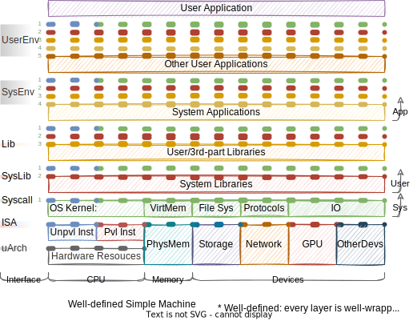

## Intro

RunXonY records "emulation/virtualization/..." project I have met.
In order to make the records in runXonY more precie and consistent,
I will first elaborate the terminolies used in runXonY.

## Terminologies

### X&Y or Guest&Host

As the name runXonY reveals, there are two entities X and Y.
In CS terminoly, them are called guest and host respectly.

### Layer, Resource and Interface

Layer includes several kinds of resources.
Layer exposes the resource to upper layer by interface.
Layer makes use of lower layer's resource by lower layer's interface.

Interface can serve multiple layers.
Traditional block diagram cannot present this "serving multiple layers" properly.
Here I use multiple lines of dots to present this "serving multiple layers".
To improve readability, echo line of dots is numbered and colored.

Layer0's 3 interfaces serve layer1 and layer2.
Layer1 make use of layer0's interfaces, exposes 2 interfaces to layer2.
Layer2 is able to make use of interfaces from layer0 and layer2.

### Well-defined Simple Machine

In order to describe guest and host in a consistent way,
I'd like to introduce a idealistic computer,
I call it "well-defined simple machine".

* "well-defined": every layer is well-wrapped,
  no resource leakage.

  For example, OS kernel is supposed to well wrap physical memory,
  is supposed to expose memory resource through virtual memory.
  User application cannot access physical memory directly.
* "simple": no emulation/virtualization/... tech is applied in this machine

In WDSM, available layers are

* uArch
* ISA
* Syscall
* SysLib
* Lib
* SysEnv
* UserEnv

## Diagram runXonY
